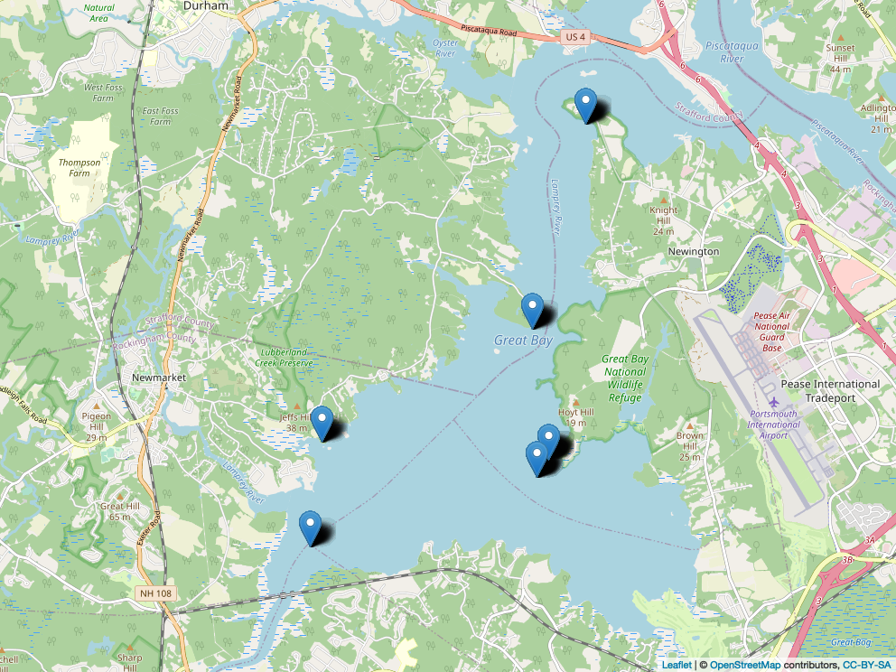

```{r setup, include=FALSE}
knitr::opts_chunk$set(echo = FALSE)
#knitr::opts_chunk$set(comment = FALSE)

require(tidyverse)
require(knitr)
require(kableExtra)
require(papeR) # signif stars in kables
#require(broom) # doesnt give signif stars in tables :(
require(lubridate)
require(leaflet)
require(ggthemes)
require(mapview) #for outputting leaflet png
require(ggsignif) #signif between years on boxplot

df <- read.csv("master_data.csv", stringsAsFactors = TRUE)
df$Date <- mdy(df$Date)

for (i in 1:nrow(df)) {
  if (df[i, "Site"] == "LR") {
    df[i, "Site_Lat"] = 43.07385
  }
}

#converts all years into same year so that figures can show months
all_year <- function(x) {
  year(x) <- 1
  return(x)
} 

```

\newpage

# Introduction

Oysters are an important member of their ecosystems, but their population has been in major decline. Oyster reefs are sites that provide habitats for many organisms, where important nutrient cycles are managed, and many more beneficial processes occur.  

Sadly, a catastrophic decline in New Hampshire oyster population has been recorded, with only 10% of the population being what it was in the 1980's. Decline has been attributed to major diseases, human harvest and anthropogenic impacts, decline in oyster shell substrate for larval settling, and low recruitment. 
  
There have been restorative efforts in the local Great Bay Estuary (GBE) of New Hampshire. Oyster spat has been distributed in restoration sites in the GBE, with different sites having varying degrees of success. Restorative success depends on recruitment in wild populations of oysters, which can depend on many factors. The ocean absorbs CO~2~ from the air. When air CO~2~ concentrations increase, it causes the pH of the ocean to go down into a more acidic environment called ocean acidification which can affect shell growth in early larval stages. 

*Salinity stuff, temperature stuff.*  

By finding where oyster larvae are most abundant throughout the GBE, this study aims to find the best environmental conditions for oyster reproduction. This data will aid future restoration efforts by showing what factors and sites to focus on for optimal results.

# Methods

Stuff

```{r, echo = FALSE, include = FALSE}
# uncomment if you want to recreate leaflet plot

#map <- leaflet(data = df) %>% 
  #addTiles() %>% 
    #addMarkers( lng = ~Site_Long, lat = ~Site_Lat)
#mapshot(map, file = "Rplot.png")
```


# physiochemical stuff

```{r}
dfLong <- df[c(1,7,8,9)] %>% 
  pivot_longer(Temp:pH, names_to = "physiochemical", values_to = "values")
dfLong$year <- format(dfLong$Date, "%Y")
```

```{r}

physiochemicalPlot <- dfLong %>% 
  ggplot(aes(x = all_year(Date), y = values), color = year) +
  geom_line(aes(color = year)) + 
  xlab("") +
  facet_grid(dfLong$physiochemical~., scales = "free", labeller = as_labeller(c(Temp = "Temperature (°C)", Sal = "Salinity", pH = "pH")))  +
     ylab(NULL) +
  theme_minimal()

physiochemicalPlot
```


# larvae type across year and site
```{r, message = FALSE}
dfLarvalType <- df %>% 
  pivot_longer(D:V, names_to = "larvalType", values_to = "avgCount")
```


```{r}
larvalYearSite <- dfLarvalType %>% 
  ggplot(aes(x = all_year(Date), y = avgCount)) +
  geom_line(aes(color = Site)) +
  labs(x = "", y = "Average Larval Count") +
  facet_wrap(year(Date)~larvalType, nrow = 3, scales = "free_y") +
  theme_minimal()
larvalYearSite
```

```{r, message = FALSE}
larvalTypeTable <- dfLarvalType
larvalTypeTable$year <- format(larvalTypeTable$Date, "%Y")
larvalTypeTable$year <- factor(larvalTypeTable$year)
larvalTypeTable$larvalType <- factor(larvalTypeTable$larvalType)
levels(larvalTypeTable$larvalType) <- c("D-hinge", "Veliger")

larvalTypeTable2 <- larvalTypeTable %>% 
  group_by(year, larvalType) %>% 
  dplyr::summarise(avgCount = mean(avgCount)) %>% 
  mutate(avgCount = formatC(avgCount, digits = 2, format = "fg")) %>% 
  pivot_wider(names_from = year, values_from = avgCount)

kable(larvalTypeTable2, align = "l")
```

```{r, message = FALSE}
larvalTypeTable3 <- larvalTypeTable %>% 
  group_by(year, larvalType, Site) %>%
  dplyr::summarise(avgCount = mean(avgCount)) %>% 
  mutate(avgCount = formatC(avgCount, digits = 2, format = "fg")) %>% 
  pivot_wider(names_from = year, values_from = avgCount) %>% 
  arrange(larvalType) %>% 
  select(larvalType, everything())

kable(larvalTypeTable3, align = "l", format = "latex", booktabs = TRUE) %>% 
  pack_rows(index = table(fct_inorder(larvalTypeTable3$larvalType)))
```
```{r}
larvalBox <- larvalTypeTable %>% 
  ggplot(aes(x = year, y = avgCount)) +
  
  geom_jitter() +
  geom_boxplot(alpha = 0.5, outlier.shape = NA) + 
  geom_signif(comparisons = list(c("2018", "2019")), map_signif_level = TRUE) + 
  geom_signif(comparisons = list(c("2019", "2020")), map_signif_level = TRUE, margin_top = 0.1) +
  geom_signif(comparisons = list(c("2018", "2020")), map_signif_level = TRUE, margin_top = 0.17,) +
  labs(x = "Year", y = "Larval Count") +
  facet_wrap(.~larvalType, scales = "free_y") +
  theme_minimal()
larvalBox
```


# ANOVA stuff

```{r, message = FALSE}
# D
dfD <- dfLarvalType %>% 
  filter(larvalType == "D")
dfD$year <- format(dfD$Date, "%Y")

dAOV <- aov(avgCount ~ year + Site, data = dfD)

anova(dAOV) %>% 
  #tidy() %>%
  prettify() %>% 
  kable(align = "l")

# V
dfV <- dfLarvalType %>% 
  filter(larvalType == "V")
dfV$year <- format(dfV$Date, "%Y")

vAOV <- aov(avgCount ~ year + Site, data = dfV)

anova(vAOV) %>% 
  #tidy %>%
  prettify() %>% 
  kable(align = "l")
```

```{r}
summary(lm(avgCount ~ Temp, data = dfD)) %>% 
  prettify() %>% 
  kable()
summary(lm(avgCount ~ Sal, data = dfD)) %>% 
  prettify() %>% 
  kable()
summary(lm(avgCount ~ pH, data = dfD)) %>% 
  prettify() %>% 
  kable()

summary(lm(avgCount ~ Temp, data = dfV)) %>% 
  prettify() %>% 
  kable()
summary(lm(avgCount ~ Sal, data = dfV)) %>% 
  prettify() %>% 
  kable()
summary(lm(avgCount ~ pH, data = dfV)) %>% 
  prettify() %>% 
  kable()
```

```{r}
#D-hinge
dTemp <- dfD %>% 
  ggplot(aes(x = Temp, y = log(avgCount))) +
  geom_point(alpha = 0.5) +
  geom_smooth(method = "lm", fullrange = TRUE, color = "black") +
  labs(x = "Temerature (°C)", y = "log D-hinge larval count") +
  theme_minimal()
dTemp

vTemp <- dfV %>% 
  ggplot(aes(x = Temp, y = log(avgCount))) +
  geom_point(alpha = 0.5) +
  geom_smooth(method = "lm", fullrange = TRUE, color = "black") +
  labs(x = "Temperature (°C)", y = "log Veliger larval count") +
  theme_minimal()
vTemp

vpH <- dfV %>% 
  ggplot(aes(x = pH, y = log(avgCount))) +
  geom_point(alpha = 0.5) +
  geom_smooth(method = "lm", fullrange = TRUE, color = "black") +
  labs(x = "pH", y = "log Veliger larval count") +
  theme_minimal()
vpH
```


