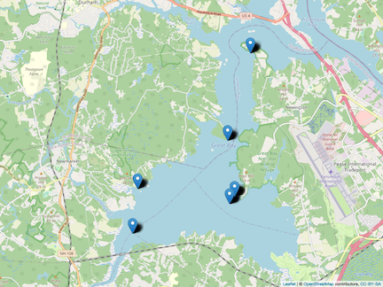

```{r setup, include=FALSE}
knitr::opts_chunk$set(echo = FALSE, warning = FALSE, message = FALSE)
knitr::opts_chunk$set(fig.height = 4.5, fig.width = 6)
#knitr::opts_chunk$set(comment = FALSE)

require(tidyverse)
require(knitr)
require(kableExtra)
require(papeR) # signif stars in kables
require(broom) # doesnt give signif stars but papeR doesnt work for hsd
require(lubridate)
require(leaflet)
require(ggthemes)
require(ggpubr)
require(mapview) #for outputting leaflet png
require(ggsignif) #signif between years on boxplot

df <- read.csv("master_data.csv", stringsAsFactors = TRUE)
df$Date <- mdy(df$Date)

for (i in 1:nrow(df)) {
  if (df[i, "Site"] == "LR") {
    df[i, "Site_Lat"] = 43.07385
  }
}

#converts all years into same year so that figures can show months
all_year <- function(x) {
  year(x) <- 1
  return(x)
} 

```

\newpage

# Introduction

Oysters are an important member of their ecosystems, but their population has been in major decline. Oyster reefs are sites that provide habitats for many organisms, where important nutrient cycles are managed, and many more beneficial processes occur.  

Sadly, a catastrophic decline in New Hampshire oyster population has been recorded, with only 10% of the population being what it was in the 1980's. Decline has been attributed to major diseases, human harvest and anthropogenic impacts, decline in oyster shell substrate for larval settling, and low recruitment. 
  
There have been restorative efforts in the local Great Bay Estuary (GBE) of New Hampshire. Oyster spat has been distributed in restoration sites in the GBE, with different sites having varying degrees of success. Restorative success depends on recruitment in wild populations of oysters, which can depend on many factors. The ocean absorbs CO~2~ from the air. When air CO~2~ concentrations increase, it causes the pH of the ocean to go down into a more acidic environment called ocean acidification which can affect shell growth in early larval stages. 

*Salinity stuff, temperature stuff.*  

By finding where oyster larvae are most abundant throughout the GBE, this study aims to find the best environmental conditions for oyster reproduction. This data will aid future restoration efforts by showing what factors and sites to focus on for optimal results.




# Methods

All data was collected at the Great Bay Estuary in New Hampshire. Six sites in total were used in the study. Woodman’s Point (WP), Nannie Island (NI), the Lamprey River (LR), and Squamscott River (SR) were collected in the 2018 and 2019 seasons. In the 2020 season WP and NI were used again, while Adams Point (AP) and an oyster farm (OF) were added. Collection of samples from the GBE and counting of D-hinge and Veliger larvae was completed by *Stasse et al.* (All techniques can be found in *insert here*). Physiochemical data was collected by the Oceanic and Atmospheric Administration's (NOAA) National Estuarine Research Reserve System (NERRS) data buoy for each sampling day. 

An analysis of variance (ANOVA) test was performed to test for differences of D-hinge and veliger counts among years. A Tukey's honnestly significant difference (HSD) was performed *post-hoc* among sampling years for D-hinge annd veliger counts. Regression models were performed for pH, temperature, and salinity as independent variables, and D-hinge and veliger counts as dependent variables. Stats were all performed using R *stuff here*.

```{r physiochemical variables across year, fig.cap= "Physiochemical data from 2018, 2019, and 2020. pH (Top), salinity (Middle), and Temperature (Bottom) are included.", fig.height = 3}
dfLong <- df[c(1,7,8,9)] %>% 
  pivot_longer(Temp:pH, names_to = "physiochemical", values_to = "values")
dfLong$year <- format(dfLong$Date, "%Y")

physiochemicalPlot <- dfLong %>% 
  ggplot(aes(x = all_year(Date), y = values), color = year) +
  geom_line(aes(color = year)) + 
  xlab("Month") +
  facet_grid(dfLong$physiochemical~., scales = "free", labeller = as_labeller(c(Temp = "Temperature (°C)", Sal = "Salinity", pH = "pH")))  +
  ylab(NULL) +
  theme_minimal()

physiochemicalPlot
```

# Results

```{r, message = FALSE}
dfLarvalType <- df %>% 
  pivot_longer(D:V, names_to = "larvalType", values_to = "avgCount")
```

```{r}
larvalTypeTable <- dfLarvalType
larvalTypeTable$year <- format(larvalTypeTable$Date, "%Y")
larvalTypeTable$year <- factor(larvalTypeTable$year)
larvalTypeTable$larvalType <- factor(larvalTypeTable$larvalType)
levels(larvalTypeTable$larvalType) <- c("D-hinge", "Veliger")
```

```{r summary stats across year and larvalType, message = FALSE}
sumLarvalType <- larvalTypeTable %>% 
  group_by(year, larvalType) %>% 
  dplyr::summarise(mean = mean(avgCount), sd = sd(avgCount), n = length(avgCount), se = sd / sqrt(n)) %>% 
  mutate(mean = formatC(mean, digits = 2, format = "fg")) %>% 
  mutate(sd = formatC(sd, digits = 2, format = "fg")) %>%
  mutate(se = formatC(se, digits = 2, format = "fg")) 

```

```{r anova of both larvae across year}
dfBoth <- dfLarvalType
dfBoth$year <- format(dfBoth$Date, "%Y")

bothAOV <- aov(avgCount ~ year, data = dfBoth)

cleanBothAOV <- bothAOV %>% 
  tidy() %>% 
  mutate_if(is.numeric, round, digits = 3)
```

```{r significant physiochemical linear models}
dfD <- dfLarvalType %>% 
  filter(larvalType == "D")
dfD$year <- format(dfD$Date, "%Y")

dfV <- dfLarvalType %>% 
  filter(larvalType == "V")
dfV$year <- format(dfV$Date, "%Y")

dTTemp <- summary(lm(avgCount ~ Temp, data = dfD))

vTTemp<- summary(lm(avgCount ~ Temp, data = dfV))
vTpH <- summary(lm(avgCount ~ pH, data = dfV)) 
```


In 2018, mean abundance was `r sumLarvalType[1,3]` (SE = `r sumLarvalType[1,6]`) D-hinge larvae m^-3^, and `r sumLarvalType[2,3]` (SE = `r sumLarvalType[2,6]`) veliger larvae m^-3^. In 2019, mean abundance was `r sumLarvalType[3,3]` (SE = `r sumLarvalType[3,6]`) D-hinge larvae m^-3^, and `r sumLarvalType[4,3]` (SE = `r sumLarvalType[4,6]`) veliger larvae m^-3^. In 2020, mean abundance was `r sumLarvalType[5,3]` (SE = `r sumLarvalType[5,6]`) D-hinge larvae m^-3^, and `r sumLarvalType[6,3]` (SE = `r sumLarvalType[6,6]`, *figure stuff*) veliger larvae m^-3^. Analysis of variance showed `r ifelse(cleanBothAOV[1,6]<=0.05, 'significant', 'insignificant')` differences in the count of both D-hinge and veliger larvae between years (F = `r cleanBothAOV[1,5]`, p `r ifelse(cleanBothAOV[1,6]<0.001, '< 0.0001', paste("= ", cleanBothAOV[1,6], sep = ""))`*figure stuff*). It was found that temperature was positivly associated with D-hinge larval counts ()


```{r larval count across year and site, fig.cap= "D-hinge and veliger oyster larval counts by site. 2018 (Top), 2019 (Middle), 2020 (Bottom) are included."}
larvalYearSite <- dfLarvalType %>% 
  ggplot(aes(x = all_year(Date), y = avgCount)) +
  geom_line(aes(color = Site)) +
  labs(x = "Months", y = "Average Larval Count") +
  facet_wrap(year(Date)~larvalType, nrow = 3, scales = "free_y") +
  theme_minimal()
larvalYearSite
```


```{r boxplot across year and larvalType with signif stars, fig.cap = "GBE larval counts of D-hinge (Left) and veliger (Right) collected in 2018, 2019, and 2020. Black dots are counts during individual collection days. Midlines within each boxplot represent median values, and the boxes represent the first (Bottom) and third (Top) quartile ranges (25th and 75th percentiles)"}
larvalBox <- larvalTypeTable %>% 
  ggplot(aes(x = year, y = avgCount)) +
  geom_jitter() +
  geom_boxplot(alpha = 0.5, outlier.shape = NA) + 
  geom_signif(comparisons = list(c("2018", "2019")), map_signif_level = TRUE) + 
  geom_signif(comparisons = list(c("2019", "2020")), map_signif_level = TRUE, margin_top = 0.1) +
  geom_signif(comparisons = list(c("2018", "2020")), map_signif_level = TRUE, margin_top = 0.17,) +
  labs(x = "Year", y = "Larval Count") +
  facet_wrap(.~larvalType, scales = "free_y") +
  theme_minimal()
larvalBox
```

```{r, message = FALSE}
larvalTypeTable3 <- larvalTypeTable %>% 
  group_by(year, larvalType, Site) %>%
  dplyr::summarise(avgCount = mean(avgCount)) %>% 
  mutate(avgCount = formatC(avgCount, digits = 2, format = "fg")) %>% 
  pivot_wider(names_from = year, values_from = avgCount) %>% 
  arrange(larvalType) %>% 
  select(larvalType, everything())

kable(larvalTypeTable3, align = "l", format = "latex", booktabs = TRUE) %>% 
  pack_rows(index = table(fct_inorder(larvalTypeTable3$larvalType)))
```


# ANOVA stuff

```{r, message = FALSE}

anova(bothAOV) %>% 
  #tidy() %>%
  prettify() %>% 
  kable(align = "l")

# D


dAOV <- aov(avgCount ~ year, data = dfD)

anova(dAOV) %>% 
  #tidy() %>%
  prettify() %>% 
  kable(align = "l")

tukeyD <- tidy(TukeyHSD(dAOV, conf.level = 0.95))
kable(tukeyD)


# V


vAOV <- aov(avgCount ~ year, data = dfV)

anova(vAOV) %>% 
  #tidy %>%
  prettify() %>% 
  kable(align = "l")
 
tukeyV <-tidy(TukeyHSD(vAOV, conf.level = 0.95))
kable(tukeyV)


```

```{r}
#signif
dTTemp <- summary(lm(avgCount ~ Temp, data = dfD))

dTTemp %>% 
  prettify() %>% 
  kable()

dTSal <- summary(lm(avgCount ~ Sal, data = dfD)) 

dTSal %>% 
  prettify() %>% 
  kable()

dTpH <- summary(lm(avgCount ~ pH, data = dfD)) 

dTpH %>% 
  prettify() %>% 
  kable()

#signif
vTTemp<- summary(lm(avgCount ~ Temp, data = dfV))

vTTemp %>% 
  prettify() %>% 
  kable()

vTSal<- summary(lm(avgCount ~ Sal, data = dfV))

vTSal %>% 
  prettify() %>% 
  kable()

#signif
vTpH <- summary(lm(avgCount ~ pH, data = dfV)) 

vTpH %>% 
  prettify() %>% 
  kable()
```

```{r, fig.height= 2.0}

dTemp <- dfD %>% 
  ggplot(aes(x = Temp, y = avgCount)) +
  geom_point(alpha = 0.5, size = 0.5) +
  geom_smooth(method = "lm", fullrange = TRUE, color = "black") +
  labs(x = "Temerature (°C)", y = "D-hinge larval count") +
  stat_cor(size = 3) +
  theme_minimal() +
  theme(text=element_text(size=10))

vTemp <- dfV %>% 
  ggplot(aes(x = Temp, y = avgCount)) +
  geom_point(alpha = 0.5, size = 0.5) +
  geom_smooth(method = "lm", fullrange = TRUE, color = "black") +
  labs(x = "Temperature (°C)", y = "Veliger larval count") +
  stat_cor(size = 3) +
  theme_minimal() +
  theme(text=element_text(size=10))

vpH <- dfV %>% 
  ggplot(aes(x = pH, y = avgCount)) +
  geom_point(alpha = 0.5, size = 0.5) +
  geom_smooth(method = "lm", fullrange = TRUE, color = "black") +
  labs(x = "pH", y = "Veliger larval count") +
  stat_cor(size = 3) +
  theme_minimal() +
  theme(text=element_text(size=10))

ggarrange(dTemp, vTemp, vpH, ncol = 3, heights = 1.5, widths = 2, labels = c("A", "B", "C"), font.label = list(size = 10))
```


```{r leaflet map, echo = FALSE, include = FALSE}
# uncomment if you want to recreate leaflet plot

#map <- leaflet(data = df) %>% 
  #addTiles() %>% 
    #addMarkers( lng = ~Site_Long, lat = ~Site_Lat)
#mapshot(map, file = "Rplot.png")

```

```{r summary stats across years and larval type kable}
sumLarvalType %>% 
  prettify() %>% 
  kable(align = "l")
```

```{r}
sumLarvalType
```


